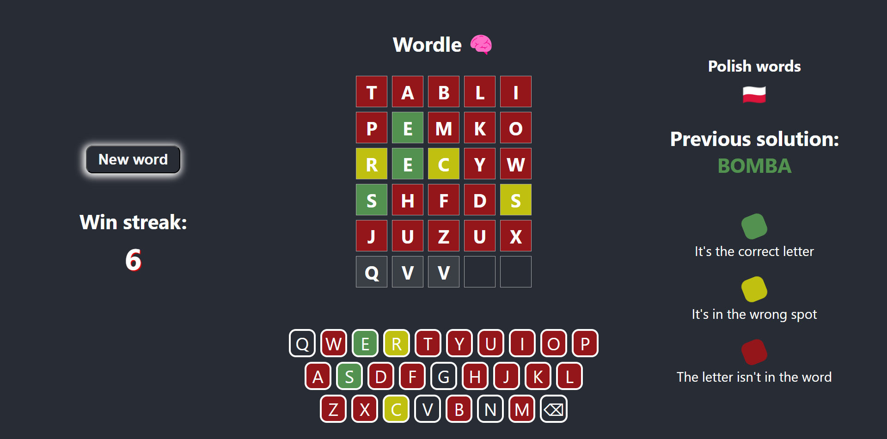

# 
 Wordle 

> Wordle is a daily word game that involves figuring out a secret five-letter word. You play by guessing different five-letter words to see how close they are to the secret word. When you submit a guess, the game will tell you how close your guess is by color-coding each letter in your guess. 

## Table of Contents
* [Technologies Used](#technologies-used)
* [Screenshots](#screenshots)
* [Project Status](#project-status)
* [Contact](#contact)

## Technologies Used
- React ^18.2.0

## Screenshots

## Project Status
_working on occasionally_

## Contact
Created by [@Jacob](mailto:jwis02202@gmail.com) - feel free to contact me!
